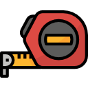

# Met - Elect
# Trena Digital

## Propósito  

O projeto trena digital tem a finalidade de criar um aplicação gráfica com suporte para mobile e desktop, 
que gere medições através do modulo de infravermelho do Arduíno ou sonar do mesmo.

## Abordagem 

Ao optar pelo uso de dois módulos no Arduíno nosso meta é gerar uma pesquisa quantitativa que analise a 
natureza dos dados colhidos em nossos testes, visto que a natureza dos dois módulos e completamente 
distinta, estamos trabalhando com luz e som, logo a abordagem de tratamento de dados visa demonstra as 
vantagens e desvantagens dos diferentes módulos em situações concorrentes.

## Procedimentos

### Itens 
    - Aplicativo trena digital.
    - Nosso protótipo de trena fisico.

Para poder medir algo o usuário deve ter em mãos nosso software(seja Mobile, ou Desktop) e nossa trena.
Em um ambiente fechado o usuário deve testar nosso produto em diferentes situações de medição 
como submerso em água , ao ar livre,em um meio repleto de corpos sólidos. Após encerrar essa etapa 
utilizamos  o aplicativo para analisar os dados, e construir diferentes representações informativas,  
ou exporta os dados coletados para o formato csv.

Caso o usuário queira uma analise mais custumizada ele pode utilizar o arquivo csv em uma plataforma como 
o excel, gerando gráficos específicos e planilhas com os dados coletados. 

## Referencias  

- [Arduíno](https://docs.arduino.cc/)
- [Qt](https://doc.qt.io/)
- [Android](https://developer.android.com/guide?hl=pt-br)
- [Artigo](https://sol.sbc.org.br/index.php/erbase/article/view/8535)

